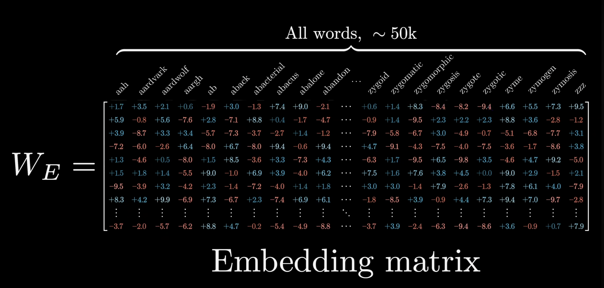

## Архитектура Transformer (2017)
1) Матрица ембедингов | W_e[n_tokens, emb_dim]
- W_e изменяется в процеccе обучения так, чтобы каждый ембединг токена отражал его смысл.
- mapper[token] -> idx 
- W_e[idx] -> строка embeding (вектор представления слова) | lookUp
на картинке столбы и строки наоборот

2) Attention

- Матрица запросов quary | Q[attention_dim, emb_dim]
    - attention_dim (at_dim) - размерность векторов матчинга (обычно меньше emb_dim)
    - Q[at_dim, emb_dim] @ e_i[emb_dim, 1] = q_i[at_dim, 1] (вектор запроса, размера attention_dim)

- Матрица ключей key | K[attention_dim, emb_dim]
    - K[at_dim, emb_dim] @ e_i[emb_dim, 1] = k_i[at_dim, 1] (вектор запроса, размера attention_dim)

100) Матрица output | W_o[n_tokens, emb_dim]
- W_o изменяется в процеccе обучения так, чтобы лучше делать предсказания
- последний вектор полученной матрицы умножаем на W_o, чтобы понять, какой ембединг стоит предсказать следующим
