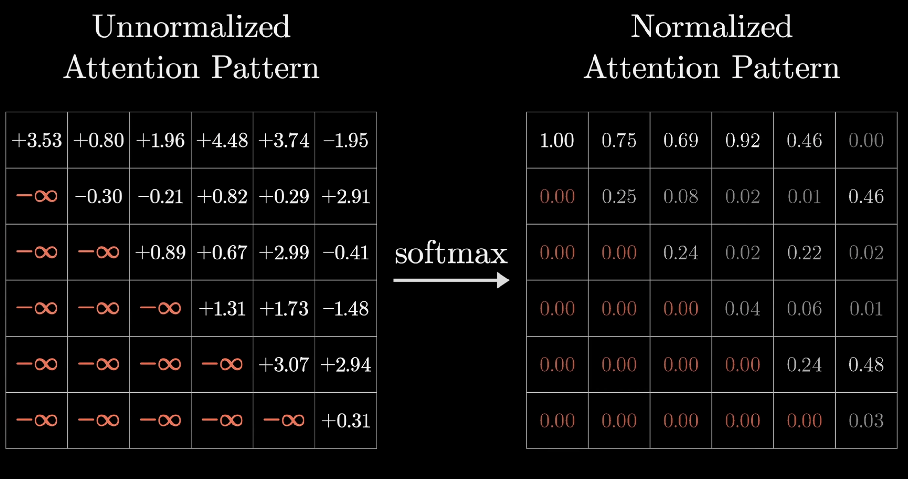

## Архитектура Transformer (2017)
1) Матрица ембедингов | W_e[n_tokens, emb_dim]
- W_e изменяется в процеccе обучения так, чтобы каждый ембединг токена отражал его смысл.
- mapper[token] -> idx 
- W_e[idx] -> строка embeding (вектор представления слова) | lookUp
на картинке столбы и строки наоборот

2) Attention pattern

- Матрица запросов quary | Q[attention_dim, emb_dim]
    - attention_dim (at_dim) - размерность векторов матчинга (обычно меньше emb_dim)
    - Q[at_dim, emb_dim] @ e_i[emb_dim, 1] = q_i[at_dim, 1] (вектор запроса, размера attention_dim)

- Матрица ключей key | K[attention_dim, emb_dim]
    - K[at_dim, emb_dim] @ e_i[emb_dim, 1] = k_i[at_dim, 1] (вектор запроса, размера attention_dim)

SoftMax вдоль столбцов

Компактный вид: \

Компактный вид у 3blue1brown (строки и столбцы наоборот): \

- Маскировка (mask): чтобы модель не подглядывала в следующие токены на этапе обучения, а училась только на предыдущих токенах

- Матрица значений value | V[emb_dim, emb_dim]
    - НО emb_dim*emb_dim это очень много параметров. Намного больше чем у Q и K. 
    - Поэтому V раскладывают на 2 матрицы: V[emb_dim, emb_dim] = V_up[emb_dim, at_dim] @ V_down[at_dim, emb_dim]
    - Теперь кол-во параметров: 2\*emb_dim\*at_dim

- На практике для multi-head attention все V_up конкатинируют в одну матрицу (output_matrix), а под value для каждой головы подразумевают value_down

100) Матрица unembedding | W_ue[n_tokens, emb_dim]
- W_ue изменяется в процеccе обучения так, чтобы лучше делать предсказания
- последний вектор полученной матрицы умножаем на W_ue, чтобы понять, какой ембединг стоит предсказать следующим
