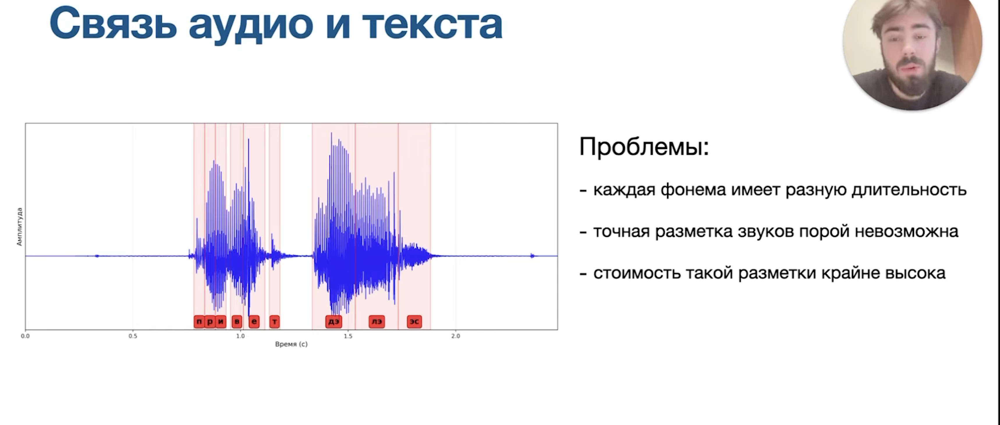

# Распознование речи

## Типы ошибок

## Метрики оценки
1) WER

Вычисление расстояния левенштейна:

## Постановка задачи
Задача выравнивания: Необходимо сопоставить графему с фреймом аудио

1) Равномерно (Не используется): Разбиваем на равные промежутки и смотрим, какая буква на них предсказана

2) Решать как задачу сегментации (Не используют)

- (-) вручную размечать каждую букву (очень дорого)

3) Seq2Seq ()

- фрейм - сжатый фрагмент сигнала (не секунды)

## pipline предсказания:
1) MelSpectrograma (Решают проблему размерности: много значений в сек -> меньше значений в сек)

2) Свертки + рекурентные сети (уменьшаем еще) -> Линейный слой (уменьшаем еще)

3) Выход линейного слоя

4) Решение проблемы дублирующихся токенов

- проблема: ииддееем___вв__ззоооопаркк -> идем в зопарк
- решение Bank token '|': ииддееем___вв__ззо|ооопаркк -> идем в зоопарк

5) Как выглядит на практике Bank token:

## Проблема: Нам подходят несколько последовательностей

### CTC Loss - для решения этой проблемы

Разбор формулы:
1) Матрица предсказаний: Y_pred (В формуле с крышкой)

2) Считаем вероятность предсказания токена по фреймам:

3) CTC визуально:

- Справа: множество "исходных текстов"
- Слева: множество "последовательностей" из которых можно получить "исходный текст"