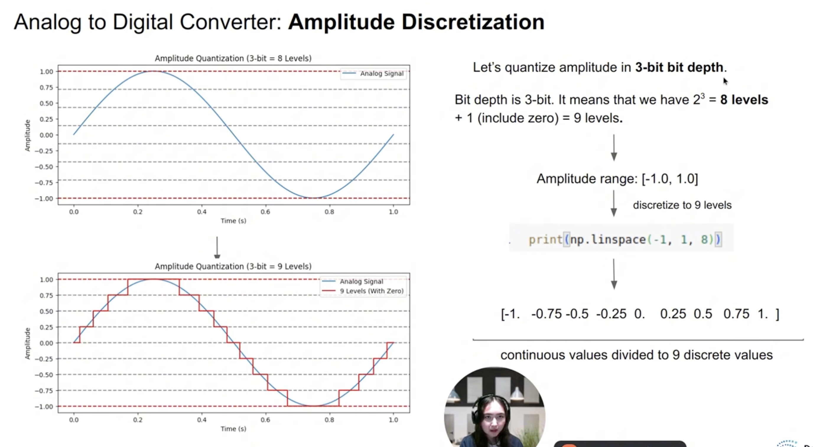
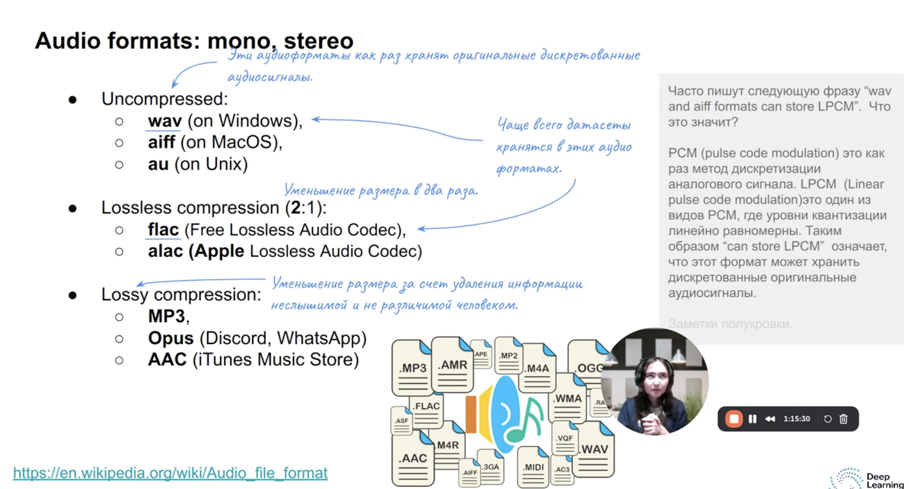
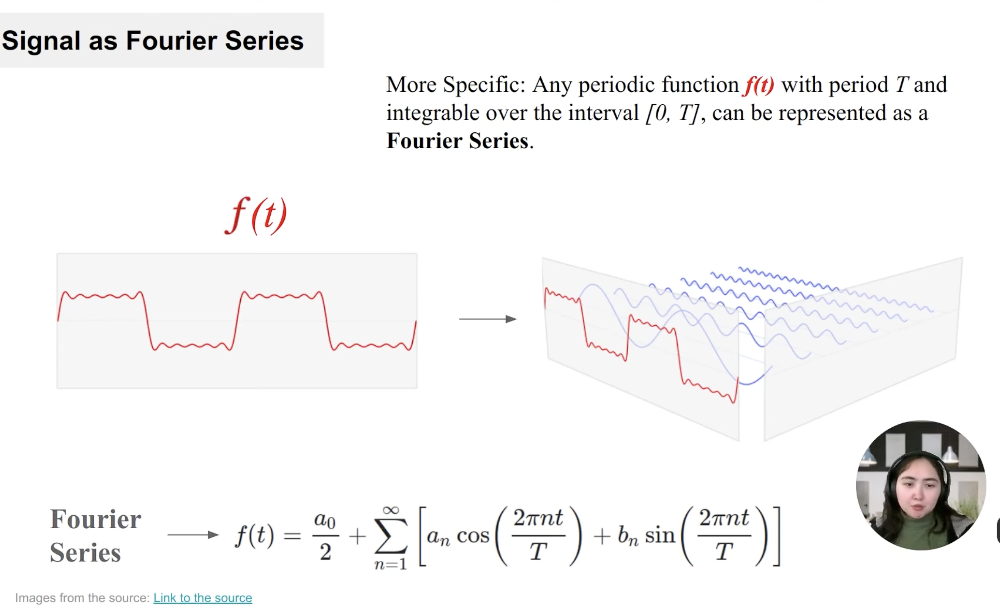
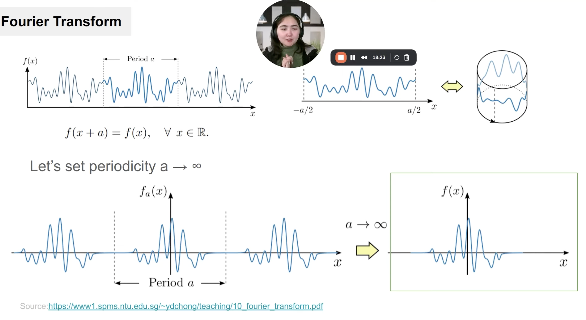
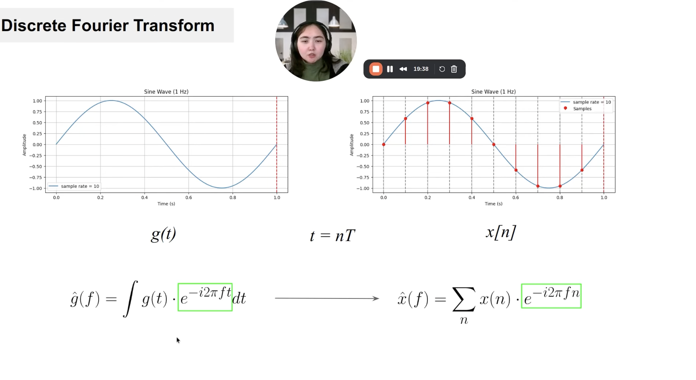
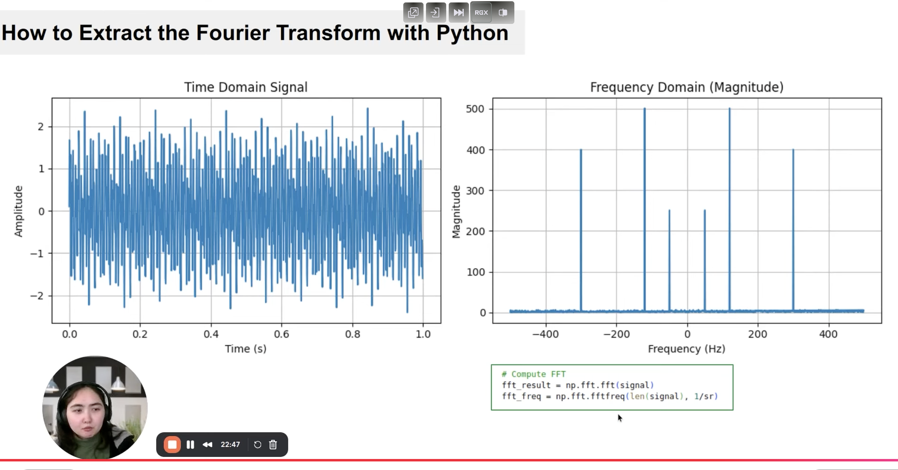
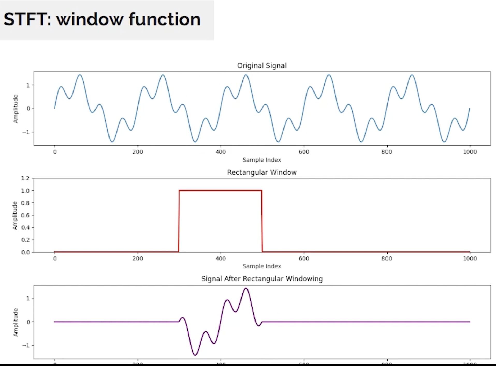
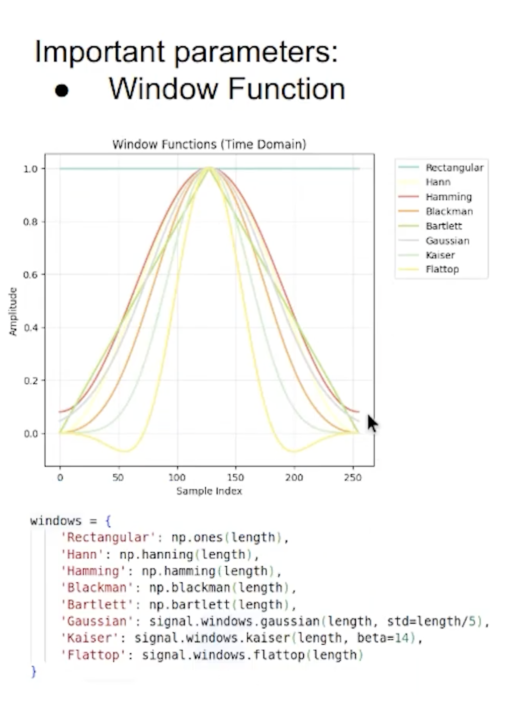
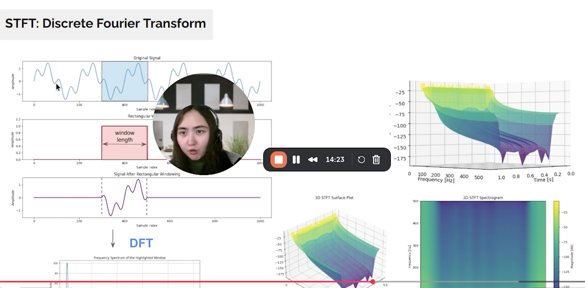
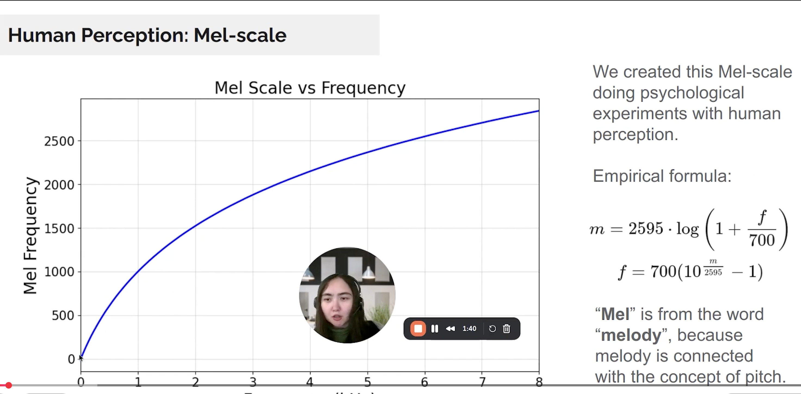

# Теория звука из первой лекции
Колаб
https://colab.research.google.com/drive/1yNGg4e-ebLFJpEbeimlgzFy9OUp93fPz#scrollTo=sSErPazoqqpl

1) dB - децеБелы
- Оценка громкости звучания. Амлитуды движения молекул
- Изначально измерялось в ПА, но это было неудобно т.к. слышимый диапазон был от 0.00002 до 20
- dB = 20*log_10(p1/p0), p0 = хз
- от 0 до 120 дБ слышимый диапозон (да, 0 слышно, это 0.00002 pa)

2) Частота (ГЦ)
- Колебания в секунду
- Отвечает за высоту звука (ноту)
- 440 ГЦ = Ля
- Слышимый диапозон: от 16Гц до 20кГц (20_000гц)

3) Частота дискритизации (семплирование) / Дискртитизация по времени
- как часто нужно делать измерение, чтобы однозначно детектировать волну
- ответ: более чем в 2 раза чаще чем частота волны с самой большой частотой: Fd = 2*max(F_i)
- Самые популярные:
    - 8кГц => максимальная частота 4кГц. Речь человека для телефонов (80Гц-8кГц, но важны для понимания лишь 300гц - 2-3кгц так что все ок)
    - 16кГц => максимальная частота 8кГц. Речь в хорошем качестве
    - 44кГц => максимальная частота 22кГц. Весь слышимый диапозон человека (20Кгц) + Немного больше, чтобы избежать алиасинга

4) Дискритиация по амплитуде
- bit_depth - глубина бита. На сколько точно мы должны хранить значение амплитуды
- Number_of_Level = 2^bit_depth. 3 bit_depth = 8 уровней
- Самые популярные:
    - 16 бит
    - 24 бит
    - 32 бита с плавующей точкой -> глубина такая же как у 24 бит аудио.
- Из-за дискритизации мы имеем quantization noise - шум квантизации. Чем меньше бит тем сильнее шум

## Форматы аудио

# Спектограммы и ряды Фурье
- Работает только для переодического сигнала. В жизни таких почти не бывает. А раскладывать хочется

Ряд фурье. Идея и формула разложения

- Fourier Transfortm.
    - Работаем с непереодичными сигналами представляя их как переодичные

Ряд фурье для непрерывных. Но комаы работаеют с дискретным пространством. Переведем.

- На практике используют Fast Fourier Transform (fft). Быстрое преобразование

# STFT (Short Time Fourier Transform)
Позволяет отобразить Частотный спектор во времени

В случае с прямоугольным окном

Какие еще бывают окна:

## Параметры
- Оконные функции (не обязательно прямоугольник)
- Длина окна
- HOP Lenghts: растояние между первым и вторым окошком (Могут пересекаться окошки) (Похоже на падинг в CV)
- n_fft: длину оконного сигнала

## Спектрограмма

# Mel spectogram
Mel - melody, т.к. связано с концепцией pitch

Mel Scale: Формула преобразования из частот в более понятные эмпирические значения
- Разница между высокими воспринимается хуже чем разница между низкими частотами
- Формула выведена эмпирически

## В итоге
как получить mel-спектрограмму
1) Audio -> Преобразование фурье (Получаем частоты)
2) Чтобы получить динамическое изменение частот мы проходим STFT (получаем спектрограмму частот)
3) melScale(Спектрограмма) -> mel_спектрограмма. Т.к. людям легче считывать эту инфу