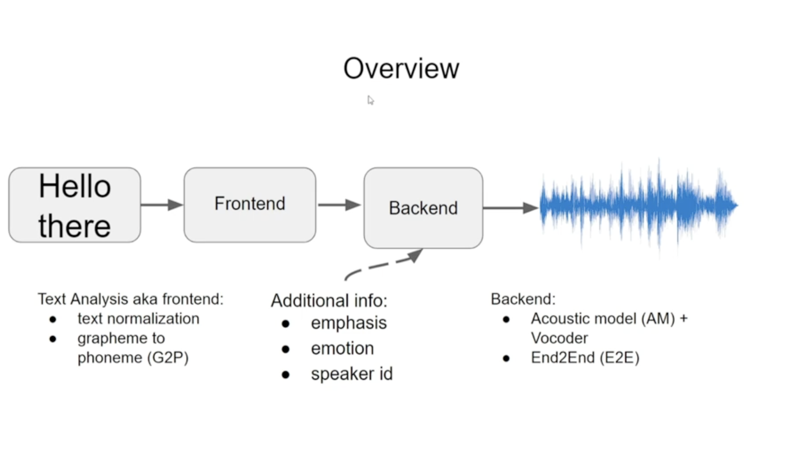
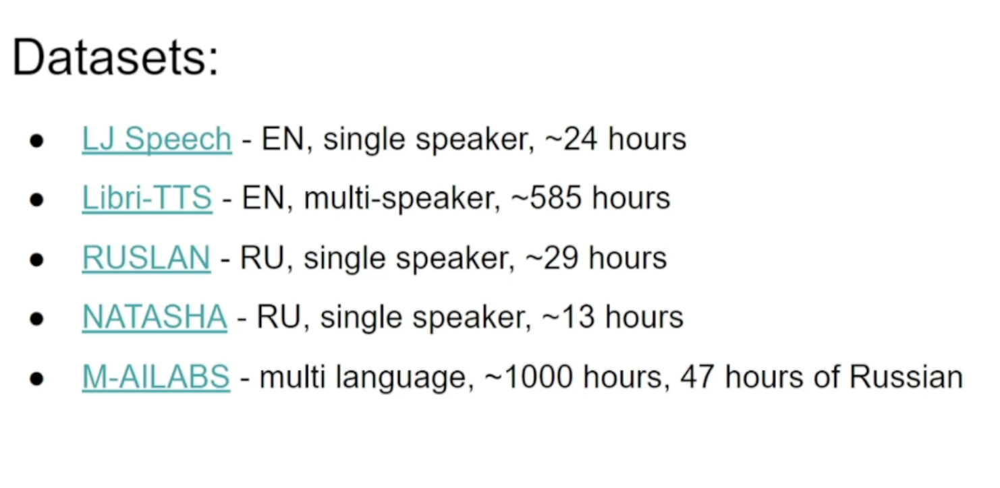
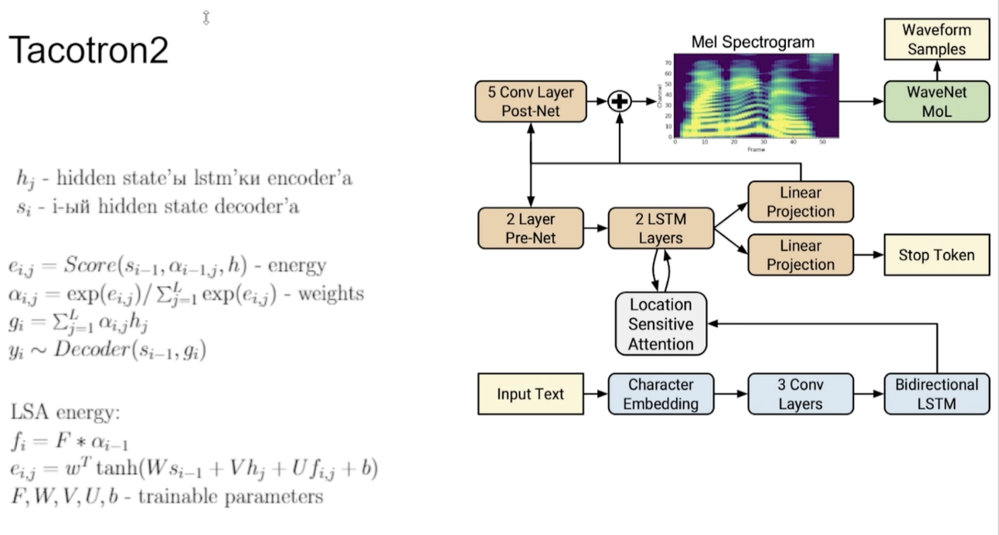
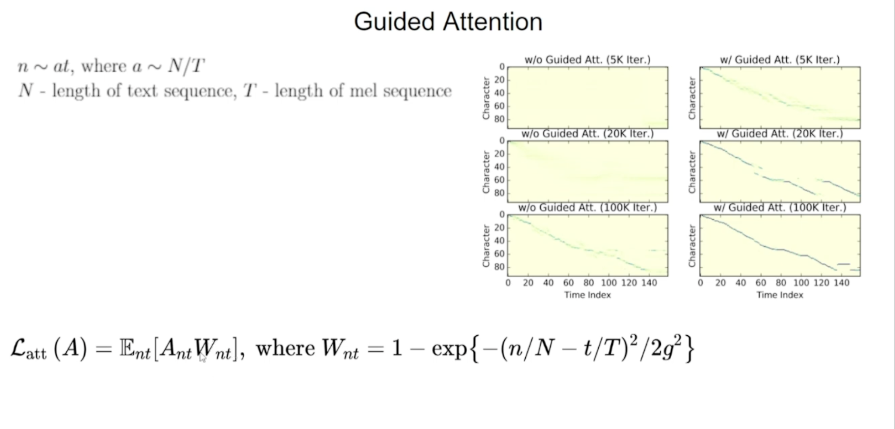
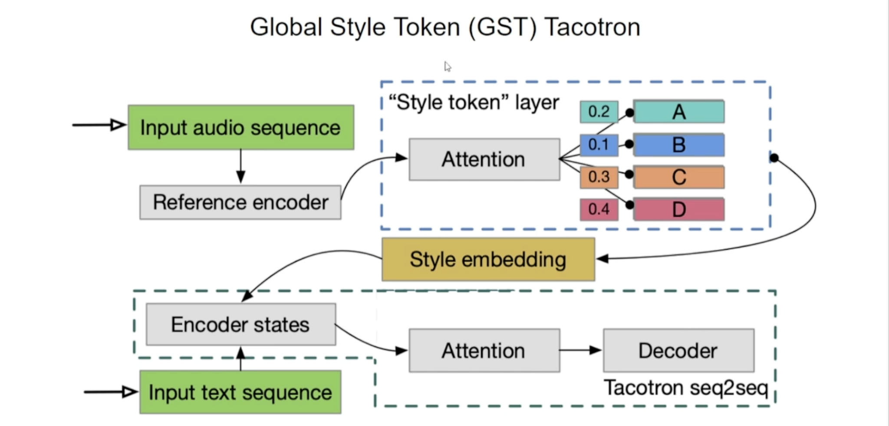
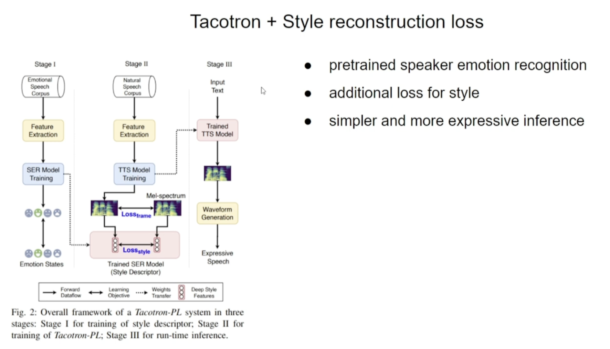
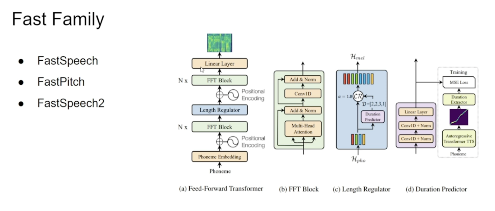
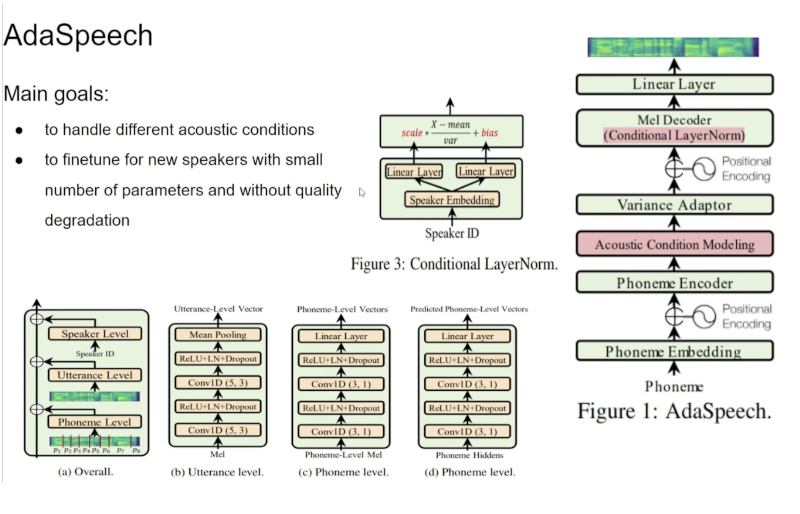

# Лекция по TTS
## Постановка задачи

1) Frontend: text -> фонемы
- text normalization:
    - "123" -> "сто двадцать три"
    - "Сокр." -> "Сокращение". Сокращения заменить на полные формы
    - "Супер Пупер" -> "супер пупер" . Перевод к нижнему регистру
- Графемы -> Фонемы ('я' -> 'иа'). GTP (Grapheme To Phoneme)
    - Графема - буква (наименьшая единица письменой речи)
    - Фонема - наименьшая единица звука 
    - Чтобы модели легче было учиться
    - пример: 'о' -> 'а'
2) Backend: фонемы + доп инфа -> речь
- доп инфа:
    - Чьим голосом должно произноситься
    - эмоциональный окрас
- Обычно 2 модели: Acoustic model (AM) + Vocoder

1. Acoustic model (AM): фонемы -> акустические фичи (mel spectogram) | Высокоуровневые признаки (Ударение, произношение, паузы, интонации)
2. Vocoder: акустические фичи (mel spectogram) -> Аудиодорожка | Низкоуровневые признаки (Шум)

## Метрики
### Subjective (Субъективные): Опрос среди людей
- MOS (Mean Opinion Score): оценка от 1-5. потом все ответы усредняют
    - (-) сложно сравнивать модели
    - (-) большая дисперсия
    - (+) абсолютная: 5-хорошо, 0-плохо

- MUSHRA: Сначала дают референс, как должна звучать модель, потом оценка от 1-5. Усредняют
    - (+-) меньше дисперсия чем с MOS
    - (+) нужна референсная дорожка
- SBS (Side By Side): Даем 2 дорожки, просим оценить, которая лучше
- Robotness: Даем случайные дорожки, просим оценить что из этого человек, а что робот
    - Тесть Тюринга на аудио

### Оjective (Объективные): Их нет, но есть сурогатные метрики
- Сурогатные метрики: (Не показывают насколько хороша модель)
    - WER/CER: Исходная vs Сгенерированная | Word Error Rate/Char Error Rate - в зависимости от выбора меняется растояние Левенштейна
        - Исходная -> ASR -> текст_исх
        - Сгенерированная -> ASR -> текст_сген
        - Растояния Левинштейна(текст_исх, текст_сген) -> S, D, I (Заменить, Удалить, Вставить) кол-во
        - N = len(текст_исх)
        - Ответ: (S+D+I)/N
    - SR (Speaker Recognition): Можно ли по аудио угадать спикера
        - аудио_исх -> SR модель -> фичи_исх
        - аудио_сген -> SR модель -> фичи_сген
        - тут фичи характеризуют спикера
        - Модель SR заранее предобучена
        - Когда говорит 1 спикер растояние между фичами - маленькое, когда разные спикеры - большое
        - Ответ: Растояние(фичи_исх, фичи_сген)
    - SER (Speaker Emotional Recognition): 
        - аудио_исх -> SER модель -> фичи_исх
        - аудио_сген -> SER модель -> фичи_сген
        - тут фичи характеризуют эмоции/стайл
        - Модель SER заранее предобучена
        - Когда эмоции те же растояние между фичами - маленькое, когда разные - большое
        - Ответ: Растояние(фичи_исх, фичи_сген)
    - Neural MOS: Пытаются предсказать MOS как задачу регресии
        - (-) varianse большой

### Errors
1) Hard: сразу понятно, что робот
- wrong stress
- Ударения
2) Soft: 
- не натуральный (naturalness)
- шумность (noisiness)

## Датасеты

## Acustic Model (AM): Фонемы -> спектограммы

### Проблемы
- Выравнивание: последовательность фонем одной длины, а последовательность мелов другой длины
- Есть 2 основных способе решения этой проблемы: 
    - Tacotron Family: С помощью Attention
    - Fast Family: Заранее откуда-то знаем. Обычно обучаем модель, которая учит сколько длиться каждая фонема

### Tacotron семейство
- seq2seq + attention

#### Tacotron2
Архитектура: 
- Attantion отличается от ванильного (добавили attention предыдущего шага)
- Pre-Net (dropout матрица, чтобы модель не сильно смотрела на предыдущий мел)

Регуляризация Лосса для более быстрой сходимости: из предположения о линейной зависимости attention

#### Global Style Token (GST) Tacotron
Модификация для улучшения качества
- Добовляем на вход референсную дорожку
- Извлекаем из нее фичи стайла (Style embedding)
- агрегируем с encoder states
- (-) нужна референсная дорожка на инференсе

Архитектура

#### Tacotron + Style reconstruction Loss
- У тебя есть запись, где диктор говорит грустно.
- Модель style recognition извлекает вектор стиля — например, [0.8 грусть, 0.1 радость, 0.1 нейтральность].
- Этот вектор подаётся в Tacotron вместе с текстом. В Loss
- Tacotron "говорит" новый текст в том же настроении и интонации.

Архитектура

### FastFamaly семейство
- FastSpeech
- FastSpeech2
- FastPitch

Особеность:
- Заранее знают сколько фреймов длиться фонема:
    1. HMM: модели, которые уились выравнивать фонемы в фреймы
    2. Взять матрицу выравнивания из Tacotron
    3. Достать из ASR (Speach Recognition) модели. (-) Но ASR учится речь -> буквы, а не речь -> фонемы

1. Архитектура FastSpeach

2. Архитектура FastSpeach 2
    - teacher forsing: 
        - на train: вместо предсказания модели подается правильный фрейм
        - на test: подается предсказание модели (для предсказания сл фрейма)

3. AdaSpeach
    - в TTS любят распутывать фичи (из mel-спектрограмы): 
        - чьим голосом произносится голос
        - какая акустика была во время записи
        - есть ли шумы
    - тут захотели отдельную фичи акустики, которых не было в предыдущих вариантах
    - чтобы на новых спикерах было проще fine-tuni'тся

# Аккустические модели
